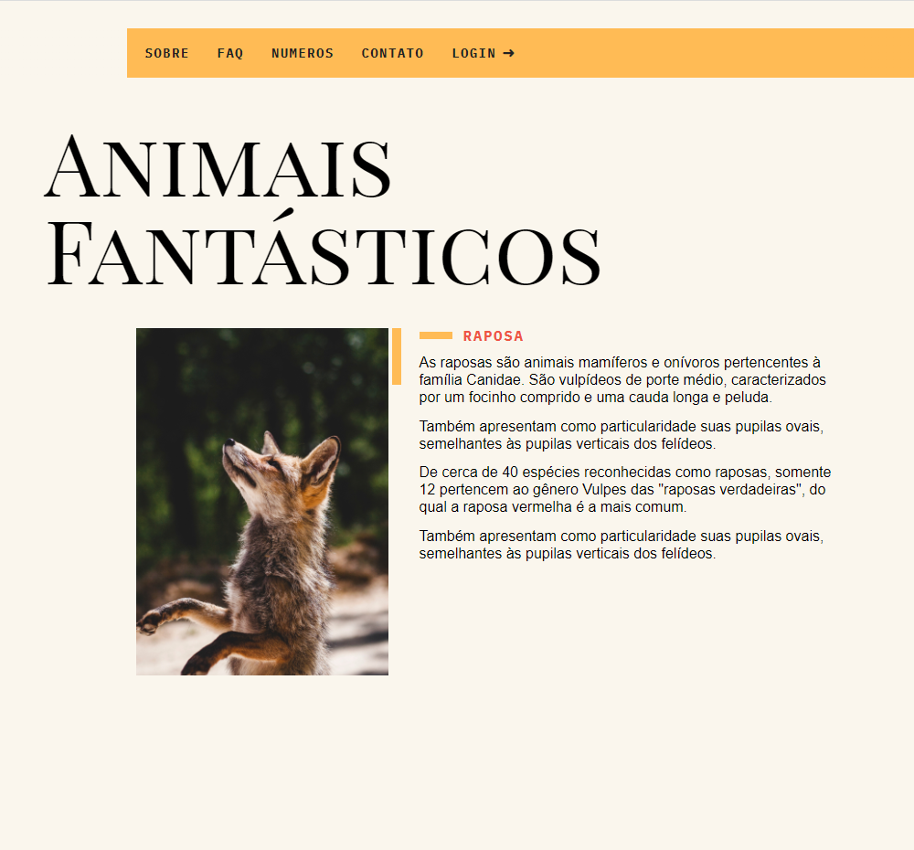
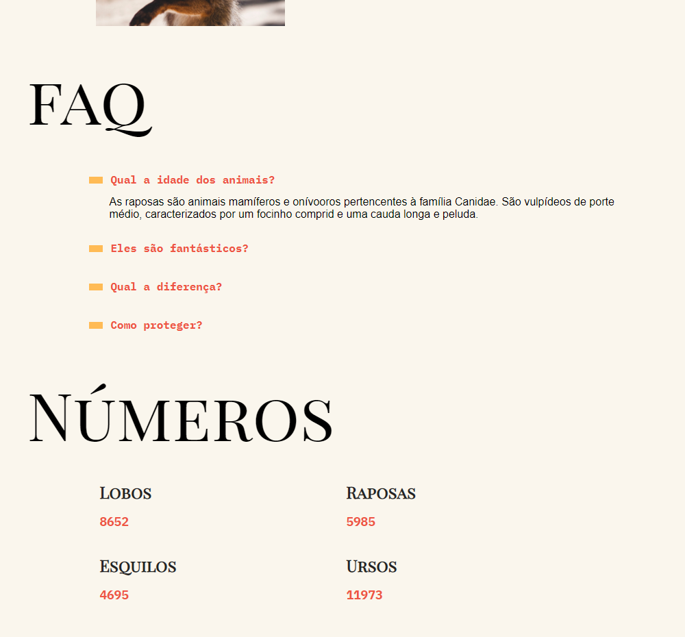
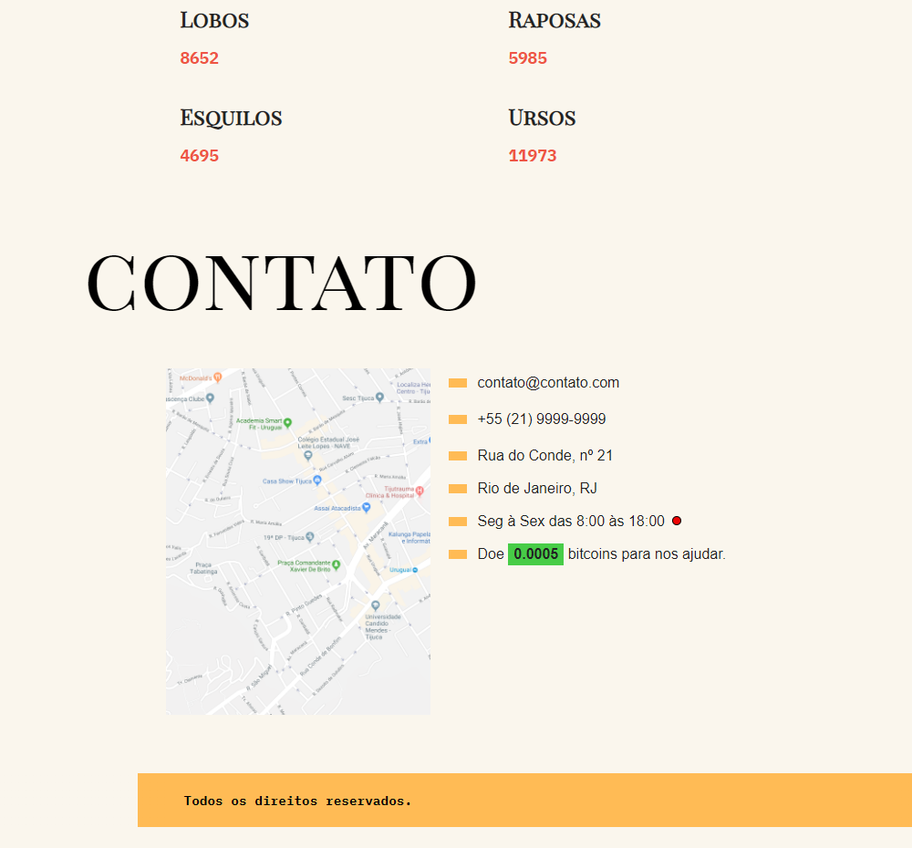

# Animais Fantásticos 🐿
Projeto final do curso de JavaScript da Origamid. </img>

  

## Sobre  </img>

Projeto criado no curso de JavaScript ES6+ da plataforma [ORIGAMID](https://www.origamid.com/)
* Functions
* Eventos e Loops
* Constructors
* Manipulando DOM
* Modal
* Promises
* Fetch API
* Async / await
* Modules

## Acesse a página </img> 

https://pablohpaiva22.github.io/animais-fantasticos/
